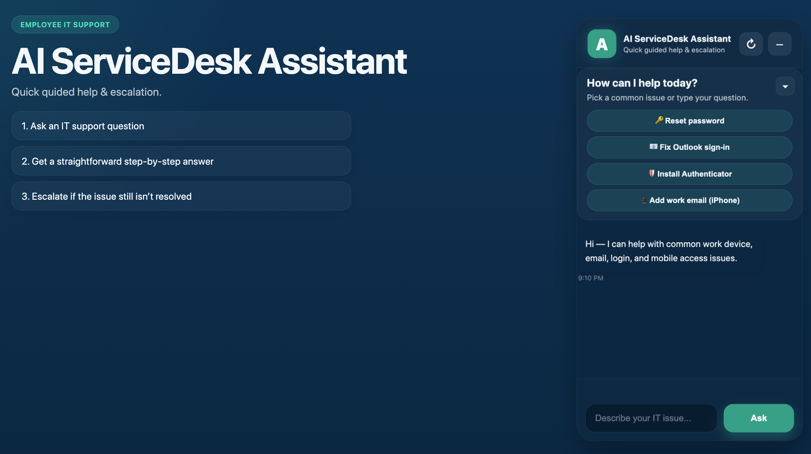
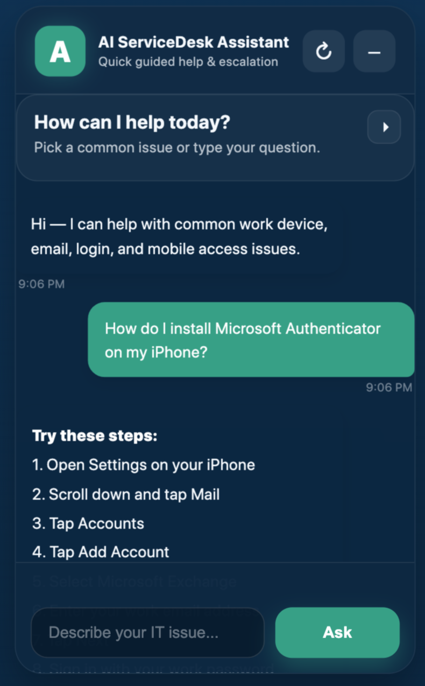
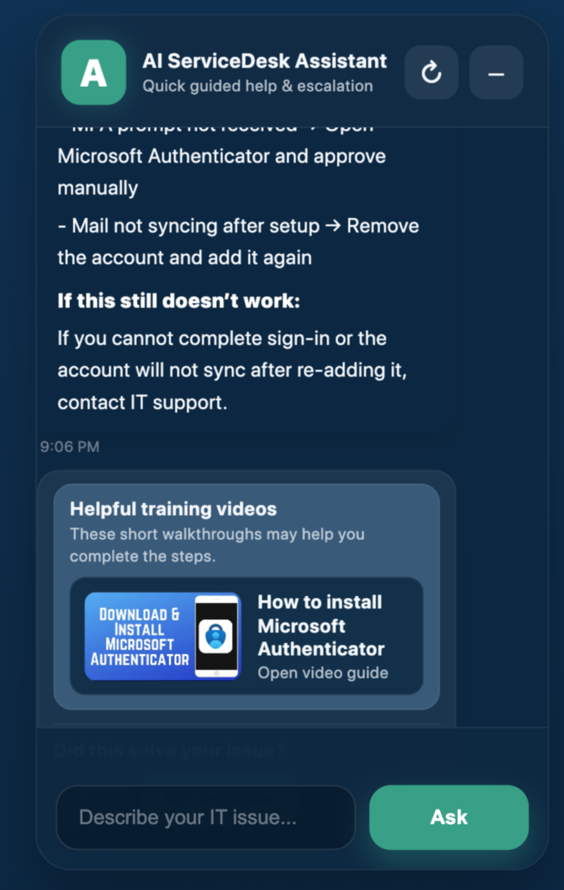
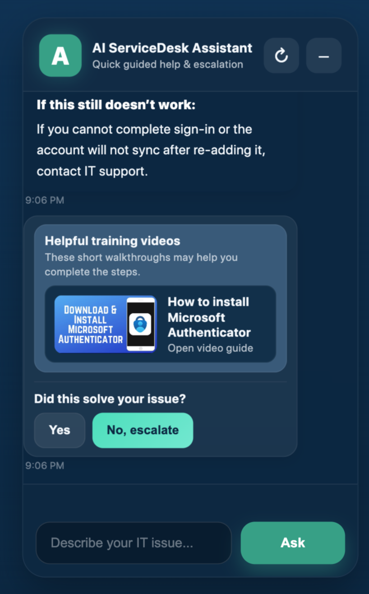
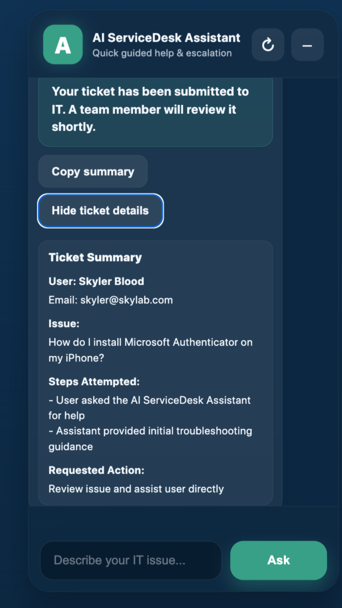

# AI ServiceDesk Assistant (RAG Helpdesk Chatbot)

A lightweight AI-powered internal IT helpdesk assistant that provides step-by-step support, training resources, and escalation summaries.

Built as a portfolio project to demonstrate real-world application of:
- Retrieval-Augmented Generation (RAG)
- UX-focused frontend design
- Secure AI interaction patterns
- IT support workflow automation

---

## 🚀 Features

### 🔹 Guided IT Support
- Step-by-step instructions for common issues
- Structured responses (Steps, Troubleshooting, Escalation)

### 🔹 Quick Actions (Common Issues)
- Reset password
- Fix Outlook sign-in
- Install Microsoft Authenticator
- Add work email (iPhone)

### 🔹 Smart UI Behavior
- Collapsible quick actions panel
- Smooth toggle animation (CSS-based rotation)
- Clean chat interface with typing indicators

### 🔹 Helpful Training Videos
- Context-aware video recommendations
- Clickable resources embedded in workflow

### 🔹 Escalation System
- Generates structured ticket summary
- Copy-to-clipboard functionality
- Expandable ticket details view

### 🔹 Safe AI Guardrails
- Blocks unsafe or malicious requests
- Prevents social engineering scenarios

---

## 🧠 Architecture

Frontend:
- HTML, CSS, Vanilla JavaScript

Backend:
- Python (FastAPI)
- RAG pipeline (knowledge base retrieval + LLM)

AI Layer:
- Claude / OpenAI (switchable)
- Prompt-structured responses

---

## 📸 Screenshots

### 🏠 Main UI


### 💬 Q&A Example


### 🎥 Helpful Videos


### 🚨 Escalation Flow


### 📋 Ticket Summary


---

## 🛠️ How It Works

1. User asks a question or selects a quick action
2. Query is sent to backend (`/ask`)
3. RAG system retrieves relevant knowledge
4. LLM generates structured response
5. UI renders:
   - Answer
   - Steps
   - Troubleshooting
   - Escalation guidance
6. Optional:
   - Training videos shown
   - Escalation summary generated

---

## 🔐 Security Considerations

- Input filtering for unsafe prompts
- No sensitive data exposure
- Simulated escalation (no real ticketing integration yet)

---

## 📌 Future Improvements

- Microsoft 365 authentication (SSO)
- Real ticketing integration (Zendesk / ServiceNow)
- Admin-side RAG for IT teams (internal Copilot)
- Conversation memory
- Analytics (top issues, resolution rate)

---

## 📦 Tech Stack

- Python / FastAPI
- JavaScript (Vanilla)
- HTML / CSS
- OpenAI / Anthropic APIs

---

## ⚡ Run Locally

```bash
pip install -r requirements.txt
uvicorn main:app --reload
```

Then open:
http://localhost:8000

---

## 👤 Author

Skyler Blood
