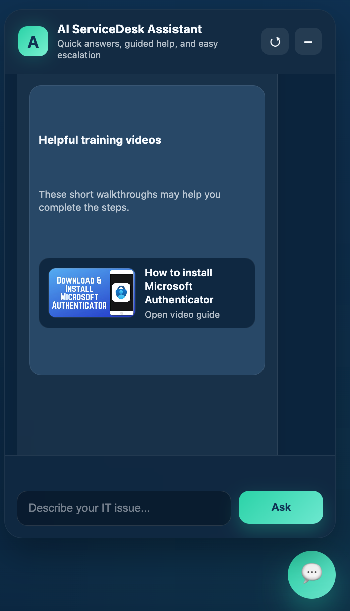
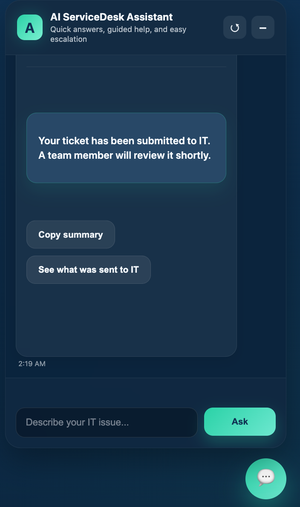

# AI ServiceDesk Assistant

An AI-powered internal IT support assistant that answers employee questions, provides step-by-step guidance, surfaces training videos, and escalates unresolved issues — simulating a real-world Service Desk + Tier 1 Support system.

---

## 🚀 Live Demo Features

### 🖥️ Clean UI Experience


---

### 💬 Ask Questions → Get Real Answers


- Password resets  
- Outlook issues  
- Authenticator setup  
- Teams mobile compliance  

Grounded in a structured internal knowledge base (RAG).

---

### 🎥 Helpful Training Videos


When helpful, the assistant provides embedded video walkthroughs to guide users visually — just like a real support experience.

---

### 🚨 Escalation Flow


If the issue isn’t resolved:
- Ticket is created
- Context is preserved
- Ready for Tier 2 support

---

## 🧠 What This Demonstrates

- Retrieval-Augmented Generation (RAG)
- Knowledge base design (real IT scenarios)
- AI + UX integration
- Escalation logic / support workflows
- Safety + grounded responses
- API integration (YouTube + LLM)

---

## 🛠️ Tech Stack

- Python (FastAPI)
- HTML / CSS (custom UI)
- OpenAI API
- YouTube API
- Local knowledge base (TXT docs)

---

## ⚙️ Run Locally

```bash
git clone https://github.com/skylersb/ai-servicedesk-assistant.git
cd ai-servicedesk-assistant
pip install -r requirements.txt
```

Create a `.env` file:

```env
OPENAI_API_KEY=your_key_here
YOUTUBE_API_KEY=your_key_here
```

Run the app:

```bash
uvicorn app.main:app --reload
```

Open:

```
http://127.0.0.1:8000
```

---

## 🎯 Why This Project Matters

This project simulates what a real internal IT support tool could look like inside a company:

- Reduces ticket volume  
- Improves employee self-service  
- Provides consistent, accurate guidance  
- Bridges Tier 1 → Tier 2 support  

---

## 👤 Author

Skyler Blood  
Building systems at the intersection of AI, automation, and human-centered design.
